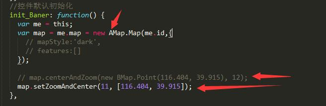
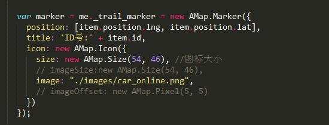
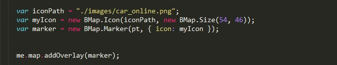
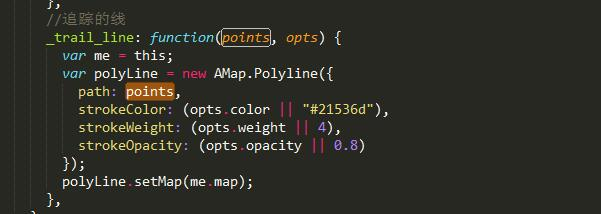
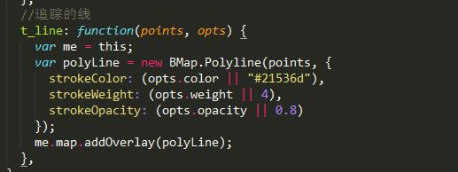

# 【一】高德地图  市区数据监控 点击进入追踪~c~

### 1.运行

```
* $ git clone 地址
* npm install 
* $ gulp;
```

### 2.项目说明（吐槽）

* 此项目是 [百度版--市区监控--实时追踪](https://github.com/zc3hd/demo_BdMap_moniter_qu) 的复制模块（高德版）。具体业务逻辑和百度这个模块的一模一样。以下就是吐槽
* 很多地方和baidu模式极其极其极其相似，相似到我都觉得高德地图的API的名字都是照搬百度的API。

#### 2.1 地图渲染

* 地图一开始要渲染，需要个ID,看下图，你妹的高德竟然类似百度地图把BMap换成了AMap，再看下面的设置中心点和层级，竟然是把百度的名字前后换了下，真牛逼。



#### 2.2 打marker

* 看下面两图，上图为高德，下图为百度。仔细一看，好吧，没有任何区别。





#### 2.3 追踪模式生成的线

* 上图为高德，下图为百度。





### 3.小结

* 用过百度的，再学习高德地图没有任何难度。项目需要，我就顺手弄了这个例子。各位自便。


 
